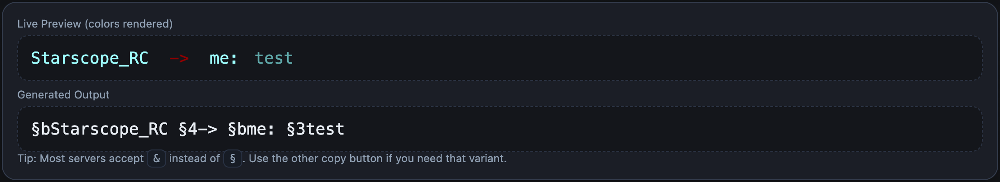

<h2>This utilises the vanilla colour coding feature in DiscordSRV to fake server broadcasts. Use with permission!</h2>
 
 

<h4>This example is faking a whisper (Chat with carbon chat installed).</h4>
